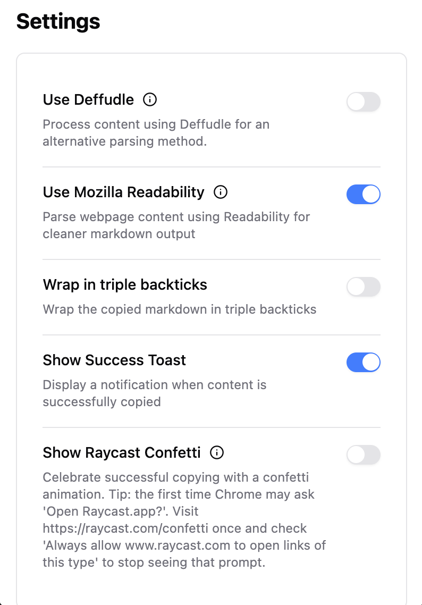

# cpdown

<div align="center">
  
  <p><em>Copy any webpage as clean markdown.</em></p>
</div>

## Overview

cpdown is a browser extension that allows you to copy the content of any webpage as clean, formatted markdown. If you're on YouTube, you can also copy the subtitle as markdown.

### Demo

https://github.com/user-attachments/assets/cedf05e8-ed1d-4e71-9769-66c9b292fbdd

## Features

- 📋 Copy any webpage content as clean markdown with one click (or keyboard shortcut)
- 📋 Copy YouTube subtitle as clean markdown with one click (or keyboard shortcut)
- 📖 Uses Defuddle or Mozilla's Readability to extract the main content
- 🔍 Removes unnecessary HTML elements (scripts, styles, iframes, etc.)
- 🔢 Shows token count for the copied content (for LLM)
- ⌨️ Keyboard shortcut support

## Installation

- Chrome: [Chrome Web Store](https://chromewebstore.google.com/detail/cpdown/knnaflplggjdedobhbidojmmnocfbopf)
- Firefox: [Firefox Add-ons](#) (Coming soon)

## Options




### Manual Installation

1. Clone this repository
2. Install dependencies:
   ```sh
   bun i
   ```
3. Build the extension:
   ```sh
   bun run build
   ```
4. Load the unpacked extension:
   - Open Chrome/Edge and navigate to `chrome://extensions`
   - Enable "Developer mode"
   - Click "Load unpacked" and select the `.output/chrome-mv3` directory

## Usage

1. Navigate to any webpage you want to copy
2. Click the cpdown icon in your browser toolbar, or use the keyboard shortcut
3. The page content will be copied to your clipboard as markdown
4. Paste the markdown content anywhere you need it

## Settings

cpdown offers several configuration options:

- **Use Defuddle**: Use Defuddle to clean up the markdown output
- **Use Mozilla Readability**: Parse webpage content using Readability for cleaner markdown output
- **Wrap in Triple Backticks**: Wrap the copied content in triple backticks for better readability
- **Show Success Toast**: Display a notification when content is successfully copied
- **Show Raycast Confetti**: Celebrate successful copying with a confetti animation (for Raycast users)

## Development

This extension is built with:

- [Cursor](https://www.cursor.com/) - For the vibe coding
- [WXT](https://wxt.dev/) - The Web Extension Toolkit
- [React](https://react.dev/) - For the options UI
- [Shadcn UI](https://ui.shadcn.com/) - For the options UI
- [Sonner](https://sonner.emilkowal.ski/) - For the toast notifications
- [Tailwind CSS](https://tailwindcss.com/) - For styling
- [Defuddle](https://github.com/kepano/defuddle) - For main content extraction & markdown cleanup
- [Mozilla Readability](https://github.com/mozilla/readability) - For main content extraction
- [Turndown](https://github.com/mixmark-io/turndown) - For HTML to Markdown conversion
- [tiktoken](https://github.com/dqbd/tiktoken) - For token counting

### Development Commands

```bash
bun run dev
```

## Star History

[](https://www.star-history.com/#ysm-dev/cpdown&Date)

## License

[MIT](LICENSE)

